# RISC-V Project

## RV32I
### instruction set
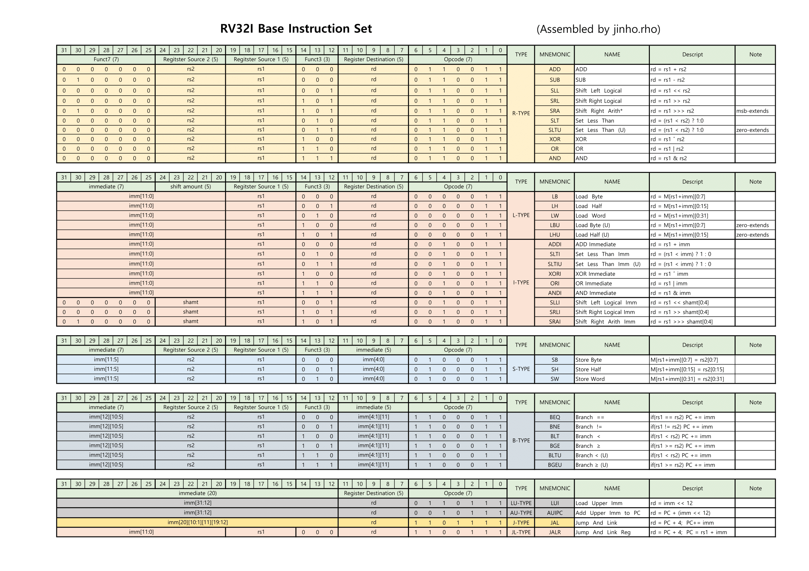 

### SingleCycleRISC-V

#### 2025 04 08
- R_Type 
  - ADD 
  - SUB 
  - SLL 
  - SRL 
  - SRA 
  - SLT 
  - SLTU 
  - XOR 
  - OR 
  - AND 

#### 2025 04 09  
- S_Type  
  - SW   
- L_Type  
  - LW   
- I_Type 
  - ADDI 
  - SLTI 
  - SLTUI 
  - XORI 
  - ORI 
  - ANDI 
  - SLLI 
  - SRLI 
  - SRAI 

#### 2025 04 10
- I_Type Error Fix 
  - operation selection 매커니즘 이슈: 
    - issue:  
      비트코드의 최상위2번째 비트를 항상 operation에 사용하여 ADDI동작에 SUB연산이 동작 
    - fix:  
      I-TYPE을 연산에 따라 case문으로 나눔 
- B_Type 
  - BEQ 
  - BNE 
  - BLT 
  - BGE 
  - BLTU 
  - BGEU 

#### 2025 04 10
- LU_Type
- AU_Type
- J_Type
- JR_Type

#### 2025 04 14
- Single Cycle RISC-V 완성 

#### 2025 04 15
- Single Cycle RISC-V 발표 

#### 2025 04 16
- B_Type Error Fix 
  - immExt 매커니즘 이슈: 
    - issue:  
    B_Type immExt에 Unsigned Integer Extend 매커니즘이 동작하고있었음. 
    - fix:  
    B_Type immExt 매커니즘을 Signed Integer 매커니즘으로 변경

### MultiCtcleRISC-V 

#### 2025 04 17
 - Fethc/Decode/Execute/MemAcc/WriteBack 스테이지에 대한 공부 
 - MultiCtcleProccesing 매커니즘 완성

## AMBA APB Protocol
### study
----------
  - rom, ram, z/0 의 CS(Chip Select) 신호는 LOW ACTIVE이다:    
    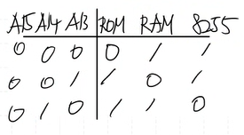  
  LOW ACTIVE의 경우 비교적 노이즈에 강하다. High Active의 경우 전압이 높아야 활성화되므로 노이즈에 취약하다.  
  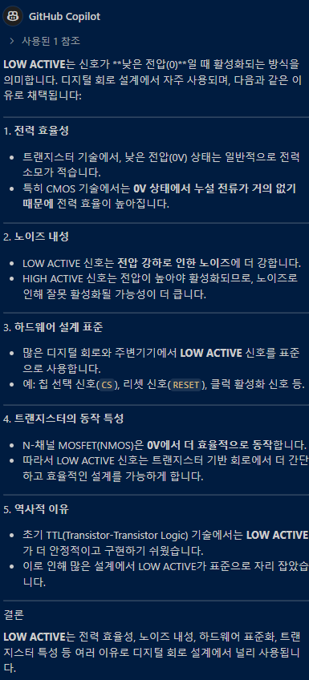  
  GPT는 똑똑하다  
----------
  - cpu는 주변기기를 구분하지 않는다. DECODER로 ENsig를 제어해줘서 주변기기를 제어해야한다.  
  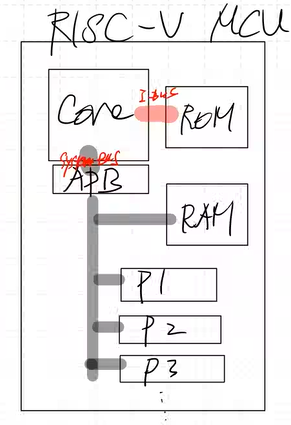  
----------  
  - memory maping  
    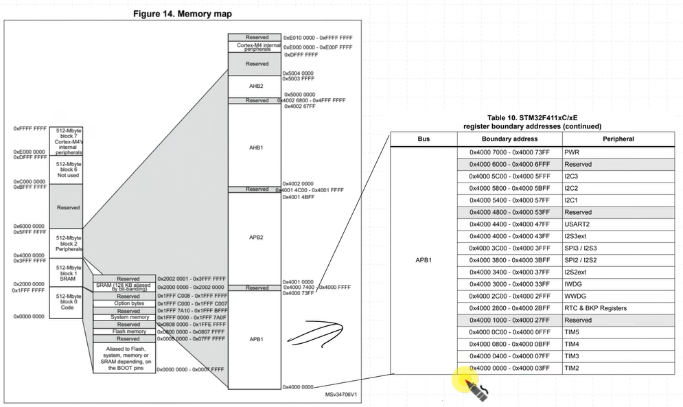
    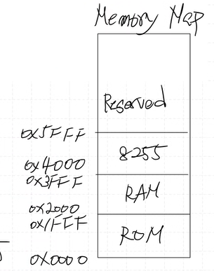  
----------
  - APB state     
  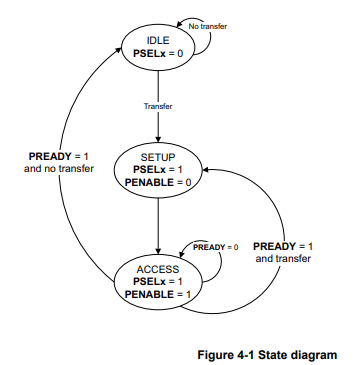  
    - write  
      - T0: Idle, T1: Setup, T2: Acces(slave ready send), T3: Idle  
      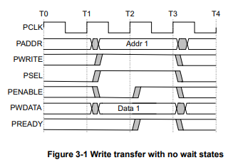  
      - T0: Idle, T1: Setup, T2: Acces(slave ready not send), T4: Acces(slave ready send), T5: Idle  
      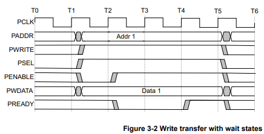  
    - read  
      - T0: Idle, T1: Setup, T2: Acces(slave ready send), T3: Idle  
      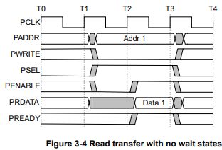  
      - T0: Idle, T1: Setup, T2: Acces(slave ready not send), T4: Acces(slave ready send), T5: Idle  
      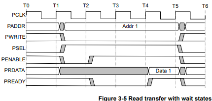  
    - ready신호는 규격화 된 범용버스으로서 쓰기 위해 표준규격을 만든것이다  
### APB MASTER  
#### 2025 04 18  
  - MASTER  Logical design
  - SLAVE   Logical design

#### 2025 04 20  
  - CPU는 모든 패리패럴을 메모리와 구분하지 않고 항상 같은 형태(프로토콜)의 신호를 보낸다.  
    "주소를 던지고 값을 읽고 쓰는 구조"가 동일하다.

#### 2025 04 21  
  - paripheral device module template  
    - APB_INTERFACE
    - GPO  
    - GPI  
    - GPIO  

#### 2025 04 22  
  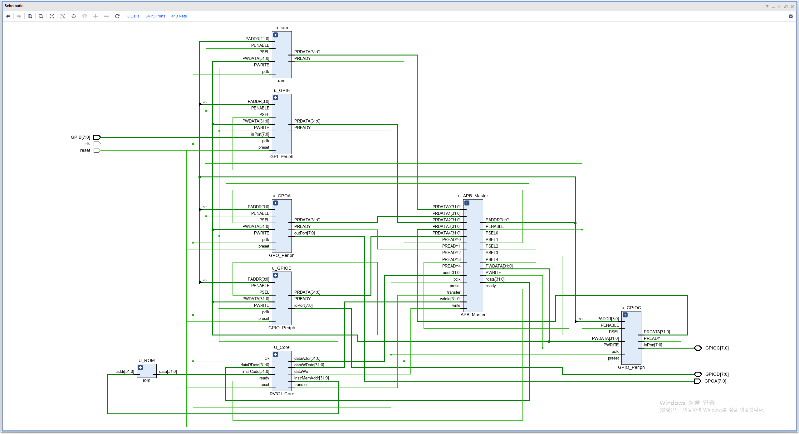    
    
  - APB interface 시험 적용
    - 7-SEGMENT  
      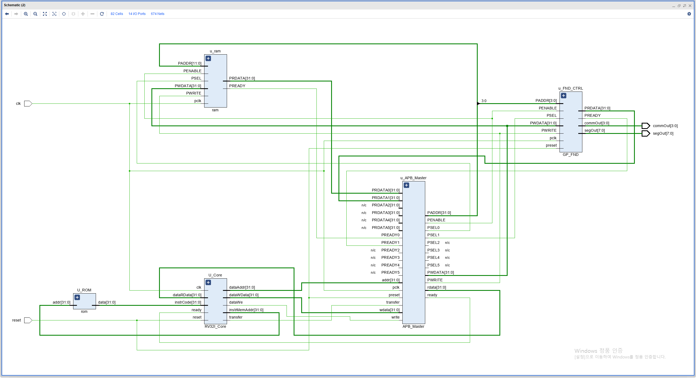

#### april miniProject  
  - RISC-V SOC AMBA APB BUS 기반 Peripheral 설계  
  - SystemVerilog TestBench  
  - 발표일: 5/7 

#### 2025 04 24
  - SV Simulation 구조  
  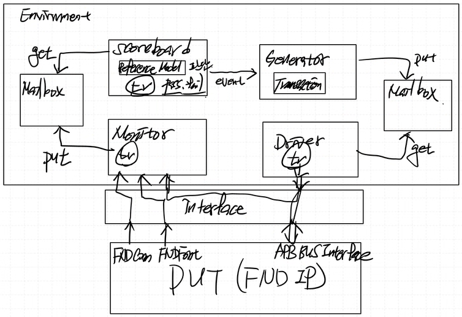  
  referenceModel: 시뮬레이션 예상값.  
  transfer: 값들을 한번에 쓰기위한 뭉탱이.  
  Generator: 값 생성 클래스  
  Driver: interface 접근/실행 클래스  
  Monitor: interface 접근/캡처 클래스  
  Scoreboard: interface 값 (refmodel과)비교 클래스  
  Interface: 실제 DUT와 연결되는 선들의 뭉탱이  
  Mailbox: C++의 컨테이너중 큐 역할.  
  - 시뮬레이션 출력 예시  
  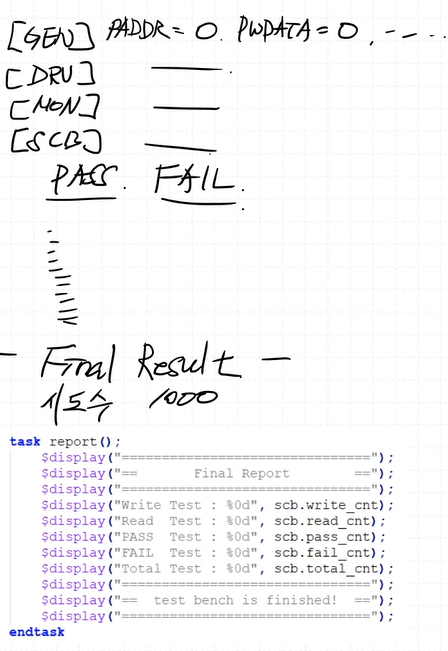  