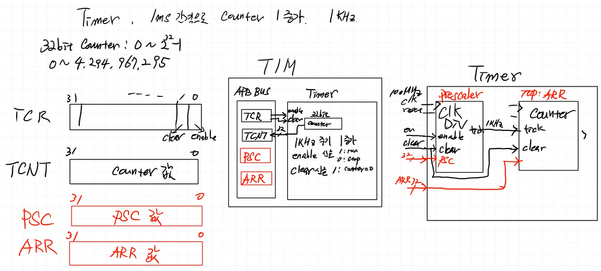

# RISC-V Project

## RV32I

### instruction set

 

### SingleCycleRISC-V

#### 2025 04 08

- R_Type  
  - ADD  
  - SUB  
  - SLL  
  - SRL  
  - SRA  
  - SLT  
  - SLTU  
  - XOR  
  - OR  
  - AND  

#### 2025 04 09

- S_Type  
  - SW  
- L_Type  
  - LW  
- I_Type  
  - ADDI  
  - SLTI  
  - SLTUI  
  - XORI  
  - ORI  
  - ANDI  
  - SLLI  
  - SRLI  
  - SRAI  

#### 2025 04 10

- I_Type Error Fix  
  - operation selection 매커니즘 이슈:  
    - issue:  
      비트코드의 최상위2번째 비트를 항상 operation에 사용하여 ADDI동작에 SUB연산이 동작 
    - fix:  
      I-TYPE을 연산에 따라 case문으로 나눔  
- B_Type  
  - BEQ  
  - BNE  
  - BLT  
  - BGE  
  - BLTU  
  - BGEU  

#### 2025 04 11

- LU_Type
- AU_Type
- J_Type
- JR_Type

#### 2025 04 14

- Single Cycle RISC-V 완성 

#### 2025 04 15

- Single Cycle RISC-V 발표 

#### 2025 04 16

- B_Type Error Fix
  - immExt 매커니즘 이슈:
    - issue:  
    B_Type immExt에 Unsigned Integer Extend 매커니즘이 동작하고있었음.
    - fix:  
    B_Type immExt 매커니즘을 Signed Integer 매커니즘으로 변경

### MultiCtcleRISC-V

#### 2025 04 17

- Fethc/Decode/Execute/MemAcc/WriteBack 스테이지에 대한 공부
- MultiCtcleProccesing 매커니즘 완성

## AMBA APB Protocol

### study

----------

- rom, ram, z/0 의 CS(Chip Select) 신호는 LOW ACTIVE이다:

      
  LOW ACTIVE의 경우 비교적 노이즈에 강하다. High Active의 경우 전압이 높아야 활성화되므로 노이즈에 취약하다.  
    
  GPT는 똑똑하다

----------

- cpu는 주변기기를 구분하지 않는다. DECODER로 ENsig를 제어해줘서 주변기기를 제어해야한다.

  

----------

- memory maping  
  
    

----------

- APB state  
    
  - write  
    - T0: Idle, T1: Setup, T2: Acces(slave ready send), T3: Idle  
        
      - T0: Idle, T1: Setup, T2: Acces(slave ready not send), T4: Acces(slave ready send), T5: Idle  
        
    - read  
      - T0: Idle, T1: Setup, T2: Acces(slave ready send), T3: Idle  
        
      - T0: Idle, T1: Setup, T2: Acces(slave ready not send), T4: Acces(slave ready send), T5: Idle  
        
    - ready신호는 규격화 된 범용버스으로서 쓰기 위해 표준규격을 만든것이다  

### 2025 04 18  

- MASTER  Logical design
- SLAVE   Logical design

### 2025 04 20  

- CPU는 모든 패리패럴을 메모리와 구분하지 않고 항상 같은 형태(프로토콜)의 신호를 보낸다.  
    "주소를 던지고 값을 읽고 쓰는 구조"가 동일하다.

### 2025 04 21  

- paripheral device module template  
  - APB_INTERFACE
  - GPO  
  - GPI  
  - GPIO  

### 2025 04 22  

  
    
- APB interface 시험 적용
  - 7-SEGMENT  
    

### april miniProject  

- RISC-V SOC AMBA APB BUS 기반 Peripheral 설계  
- SystemVerilog TestBench  
- 발표일: 5/7  

### 2025 04 24

- SV Simulation 구조  
    
  referenceModel: 시뮬레이션 예상값.  
  transfer: 값들을 한번에 쓰기위한 뭉탱이.  
  Generator: 값 생성 클래스  
  Driver: interface 접근/실행 클래스  
  Monitor: interface 접근/캡처 클래스  
  Scoreboard: interface 값 (refmodel과)비교 클래스  
  Interface: 실제 DUT와 연결되는 선들의 뭉탱이  
  Mailbox: C++의 컨테이너중 큐 역할.  
  - 시뮬레이션 출력 예시  
  

### 2025 04 24

- FIFO mem(QUEUE, IOBUFFER) 
  - 버퍼 사용 이유: 도메인간 클럭차이 또는 입출력동작속도의 차이가 생길때(싱크가 안맞을때) 데이터를 잡아둘 용도로 사용.
  - FIFO mem: 선입선출형 메모리
  - 구조  
    
  - 예시 입출력  
    
    
    
  - 합성된 회로  
  
  - 시뮬레이션  
    

### 2025 04 25~27

- 입출력 버퍼 AMAB버스에 연결해보기.  
   

### 2025 04 28

- DATA_SHEET 작성 예시  
   
  - GP_COUNTER  
   

## AMBA AXI Protocol  

### STUDY

- bus: brodcast식으로 한방에 전부 보냄  
- point to point: 일대일 연결  
- AXI is not BUS specification, but **point to point specification**  
    
- AXI channels  
    
  WR과 RD의 ADDR이 분리되어 복잡해보인다. 하지만 충분히 가치가 있을것.  
  각 채널은 uniderectional(단방향이다)
  각 체널이 단방향이기에 WRITE RESPONSE가 따로있다. READ Response는 READ Data에 포함시켜서 보낸다. (WRITE는 master to slave이기 때문에 slave의 상태를 master에게 알릴 필요가 있으나 READ는 slave to master이기에 READ Data가 곧 slave의 상태이다.)
  채널이 분리되어 있기 때문에 READ와 WRITE가 같은 시간(타이밍)에 **가능**하다.  
    
    
- channel handshake(valid ready handshake)  
    
    
  valid 신호는 inforamtion(예를들어 ADDR, RDATA, WDATA)이 유효함(valid)을 알린다.(거리,온습도 센서 할 때 done 신호를 생각하면 이해가 쉬울것)  
  ready 신호는 피수신자가 수신가능상태임을 알린다.  
  동기 handshake를 사용한다(clk에 맞춰서 동작한다.)  
- channel: 데이터 하나를 보내는 신호선 뭉탱이  
    
- transaction: 같은 기능의 채널들의 뭉탱이  
    
- axi와 ahb차이는? -> ahb는 브로드캐스트방식 한방에 보냄 axi는 포인트투포인트방식이며 밸리드레디핸드셰이크형태를 가진다. 덕분에 read write 동시에 가능.  
- Channel transfer examples(AXI는 아래 케이스가 다 되는 회로임)  
  - case1: valid를 받고나서 ready하는 경우(일반적인 상황)  
      
    1: idle  
    2: valid high  
    3: ready high  
    4: handshake  
  - case2: information을 먼저 받고 ready를 하는 경우(데이터가 들어올것이 기대되는(확정된)상황)  
      
    1: idle  
    2: ready high  
    3: valid high  
    4: handshake  
    (예시): waddr이 들어온 상태일때 WDATA가 들어올게 확실하니 미리 READY를 준비시켜서(asserted) 한클럭 클럭 아낄 수 있다  
  - case3: valid, ready동시(잘안쓰임 양측이 전부 조합회로여야 가능)  
      
    1: idle  
    2: no change  
    3: valid, ready high  
    4: handshake  
- Write transaction: single data item  
    
    
  - Write transaction handshake dependencies  
      
- Read transaction: single data item  
  
  - read transaction handshake dependencies  
    

### 2025 05 12

- axi diagram  
    
  